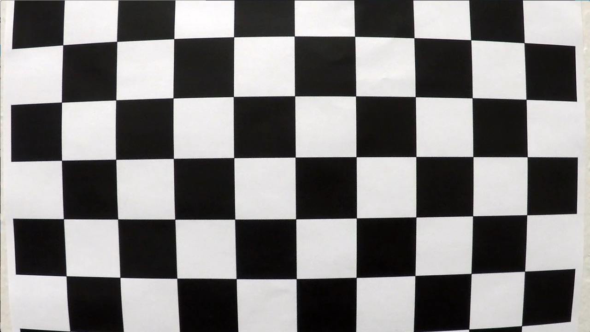

## Advanced Lane Finding Project
---
### Introduction
This project is a part of coursework of Udacity Self Driving Nanodegree. The projects aim is to revisit the learnings from Image processing and Computer vision concepts and apply them to solve a real world simple version of a complex problem - Lane Identification for Self Driving Cars. Here we mostly use Traditional methods, most of the outputs are based on Thresholding methods and some Poly Fit math, I have also attached a sample video of State of the Art Latest deep learning approaches to just show the progress we made as a Self Driving community. Code for DL approaches not available here, This repo is only for Traditional methods, for DL approaches I have provided references.


### Goal 
To find the Lane boundaries, Curvature and Vehicles position from a Car Frontal Cam View.

### Steps
* Compute the camera calibration matrix and distortion coefficients given a set of chessboard images.
* Apply a distortion correction to raw images.
* Use color transforms, gradients, etc., to create a thresholded binary image.
* Apply a perspective transform to rectify binary image ("birds-eye view").
* Detect lane pixels and fit to find the lane boundary.
* Determine the curvature of the lane and vehicle position with respect to center.
* Warp the detected lane boundaries back onto the original image.
* Output visual display of the lane boundaries and numerical estimation of lane curvature and vehicle position.

<p align="center">
    <br>
    <b>Sample Output</b><br>
</p>

### Pipeline - Flow Diagram
 


### Code-Folder Explanation


* lib is the source folder for all the modules.
* `img_operations.py` contains all the objects and methods necessary for image transformation
* `cam_calibration.py` contains all the objects and methods necessary for Camera Calibration and calculation of Distortion Coefficient.
* `lane_finder.py` contains all the objects and methods necessary for Lane Detection, Identification, Curvature measurement and Helper functions for plotting the output on Images or videos
* `main.py` is the Main program to run the Code. It imports all the functions above and capable to work with both video and image.
* test_images contains test images
* camera_cal contains the calibration Images
* output_images contains the outputs of test images


### How to Run
The code can be executed with the help of simple python3 main.py call with arguments
****Arguments****

        * -i/--input ==> To give the Input Path
        * -it/--input_type ==> To specify input type <video/image>
        * -o/--output_path ==> Output Path, default set to output_images -> Folder path only (Default Output File is saved with <input_file_name>_output.*)

*****Install Dependencies*****

        pip3 install -r requirements.txt

****Run Command****

        python3 main.py -i <video_path/image_path> --it <video/image> 
        -o <output_path>

        Example Command:
        python3 main.py -i ./project_video.mp4 -it video -o ./output_images/

### Camera Calibration

When a camera looks at a 3D Object and tries to register it to a 2D Image. The 2D representation becomes a bit distorted because of the 3D and angular aspects of the Object. Usually this involves multiple aspects such as the Position of the object, Angle w.r.t plane /camera plane, Camera Relative position, Camera Focal length etc. These distortion coefficients and calibration are calculated with the help of a Pinhole Model approach.
This Calibration of Camera is available as a module in OpenCV called 
cv2.calibrateCamera() and the Distorition correction is applied using cv2.undistort(). This calibration is performed on 20 Chessboard Images.
All these methods are present in the file --> `lib/cam_calibration.py`
In this, I started by preparing "object points", which will be the (x, y, z) coordinates of the chessboard corners in the world(Chessboard Object points Dimension- 9*6). Here I am assuming the chessboard is fixed on the (x, y) plane at z=0, such that the object points are the same for each calibration image.  Thus, `objp` is just a replicated array of coordinates, and `objpoints` will be appended with a copy of it every time I successfully detect all chessboard corners in a test image.  `imgpoints` will be appended with the (x, y) pixel position of each of the corners in the image plane with each successful chessboard detection. 
I then used the output `objpoints` and `imgpoints` to compute the camera calibration and distortion coefficients using the `cv2.calibrateCamera()` function. The calculated coefficients can be used with `cv2.undistort()` function to undistort a image.


A Sample result is attached here.

<table>
  <tr>
    <td>Distorted Calibration1</td>
    <td>Undistorted Calibration1</td>
   </tr> 
   <tr>
      <td>Distorted Test6</td>
      <td>Undistorted Test6
  </td>
  </tr>
</table>

###  Pipeline (Single Image Based) - Explanation
Throughout this explanation the image we used is the Test3.jpg in test_images.
The code is configured to save these intermediate outputs by specifying a flag named `save_intermediate_out` in the `main.py`.
#### 1. Distortion Correction

To Demonstrate this we will be using the test6 image in test_images

<p align="center">
    <br>
    <b>Distortion Correction Output</b><br>
</p>

#### 2. Transforms, Gradients --> Image Thresholding
First I cropped the image to approximately half, and this parameter can be varied to filter the noise which is not having the Road lanes in context.
Post that I transformed the Image using Sobel Threshold and Individual threshold on HLS Channel as HLS is a prominent color space for explaining the image with respect to different environmental conditions.
The Code for my Transforms and Gradients is present in `img_operations.py` under `ImgOperator` Class.
You can finetune the thresholds or the cropping size from the initialization variables in the class.

<p align="center">
    <br>
    <b>Sobel Threshold Output</b><br>
</p>

<p align="center">
    <br>
    <b>HLS Threshold Output</b><br>
</p>

Post that , I combined both threshold to get more accurate representation and a mix of both Sobel Directional, Magnitude and HLS Individual Channel thresholds.

Combined Threshold Output

<p align="center">
    <br>
    <b>Combined Threshold Output</b><br>
</p>

#### 3. Perspective Transform --> Warping
The code for my Perspective transform for Warping the Image in Birds eye view is present in `img_operations.py` under `ImgOperator` class under `warp_image` method.


The method takes input arguemnts - Image, src, dst, size
Image - Image after thresholding
src - Selected keypoints for Transformation
dst - Output Keypoints on how which the projection should happen
size - Size of the output image

Please find the src, dst keypoint selection. These threshold can further be tuned.
```python
    s_ltop, s_rtop = [img_size[1] / 2 - 24, 5], [img_size[1] / 2 + 24, 5]
    s_lbottom, s_rbottom = [110, img_size[0]], [img_size[1] - 50, img_size[0]]
    src = np.float32([s_lbottom, s_ltop, s_rtop, s_rbottom])
    dst = np.float32([(150, 720), (150, 0), (500, 0), (500, 720)])
```

#####  Warped - Perspective Transform Output of above Combined threshold Image


<p align="center">
    <br>
    <b>Perspective Transform Output</b><br>
</p>

#### 4. Lane Finding
On the perspective transform output, I performed three steps to get the lanes.
1. Histogram of the Perspective output to identify the lanes by finding the max of the histogram and assigning the peaks as the left lane and right lane starting points.
2. Then a custom window size  and window border size is specified
   Here i used window_size as 10 and this can be further be tuned. And the window border size is 50 currently and this can be further tuned.
   These two parameter helps us to tune the Sliding window size.
     *  Height of the Sliding window = total_height/window_sizw
      * left edge of the sliding window = lane_center - window_border_size
      * right edge of the sliding window = lane_center + window_border_size
3. Then a Blind search is performed to traverse the window on the intensified lanes.

Output of the Lane finder Class.
The entire code is present in `lib/lane_finder.py`  under class `LaneFinder` and the lane thresholds can be tuned in both `LaneFinder` and `Lane`.

<p align="center">
    <br>
    <b>Lane Finding Output</b><br>
</p>

#### 5. Radius of Curvature and Vehicle Relative Position Calculation

I performed this calculation in the file `lib/lane_finder.py` under class `LaneFinder` and defined under `draw_road_info` method.

#### 6. Final Result plotted back to Unwarped Image

I performed this plotting in the file `lib/lane_finder.py` under class `LaneFinder` and defined under `draw_lane` method.
Further the output is passed onto `draw_road_info` function to print the necessary outputs on the Unwarped output Image.

<p align="center">
    <br>
    <b>Unwarped Final Output</b><br>
</p>

---

### Pipeline (video) Links

***Traditional Methods***

1. [Project Video Output](https://drive.google.com/file/d/1r1HQK5NaE-fCgoD5vuhdZX-uQVtEaA_O/view?usp=sharing)
2. [Challenge Video Output](https://drive.google.com/file/d/1Da1R5fr3ajiQUE_16a651buRiW1iWeYN/view?usp=sharing)
3. [Harder Challenge Video Output](https://drive.google.com/file/d/1LXrBjy6OwV7ngiTOmSeSIThl1awAhL1P/view?usp=sharing)

***DeepLearning Methods***
This is just to show some current SOTA methods I have gone through and tried to experiment with to understand how we are solving this problem now.


    Deep Lane Detection methods are classified under three categories
    1. Segmentation Based
        * Segmentation based method usually exploit Foreground Texture to segment the Line pixels and decode these pixels into line instances 
    2. Point Detection Based
        * Point Based methods usually adopt RCNN framework and detect lanes by detecting a series of keypoints. 
    3. Curve Based methods
       * Tries to model the lane lines as hollistic curves such as polynomial curves.

The below results are obtained from a [Open source implementation](https://github.com/voldemortX/pytorch-auto-drive) using Baseline config of a Real Time semantic segmentation implementation named ERF Net (A point based network- [Paper](https://sh-tsang.medium.com/reading-erfnet-efficient-residual-factorized-convnet-for-real-time-semantic-segmentation-4dd85991647e)).

Please follow the links to find the video outputs.

1. [Project Video DL Output](https://drive.google.com/file/d/1mzqIHnHdm9r6qq-vFdHVWcdHRZaKWG0D/view?usp=sharing)
2. [Challenge Video DL Output](https://drive.google.com/file/d/1Pn9kJ8zu5e7miIsp8gzgicMdHVhJBshR/view?usp=sharing)
3. [Harder Challenge Video Output](https://drive.google.com/file/d/1bWsZe6zjGEL40ZYWEwkjR-K7BzCfRcnc/view?usp=sharing)


### Discussion
* Even though the current output is not bad, it needs a lot of improvement in Stability and Generalization perspective. As there are many thresholds currently in place to obtain the desired output, this is very hard in Real world scenarios.
* Also the current approach when I tested with Challenge and Harder Challenge, it was struggling to give a stable output, this will be a major issue as it can throw the car off the lane, especially I saw this scenario on Harder Challenge. 
* Most of the current thresholds I have finetuned are for Project Videos and Stable Test Images but given a more diversified scenario these thresholds might not work.
* This is where I came across Deep learning based SOTA approaches and tried to play with them and linked the output videos under Deep Learning methods.
* Overall, this is a quite interesting problem and helped me a lot to learn on how different image filters work and the CNN based approaches similar to them.

### References

* https://towardsdatascience.com/teaching-cars-to-see-advanced-lane-detection-using-computer-vision-87a01de0424f
* https://github.com/voldemortX/pytorch-auto-drive
* After going through several blogs this repository helped me to organize my ideas clearer -> https://github.com/windowsub0406/Advanced-lane-finding

